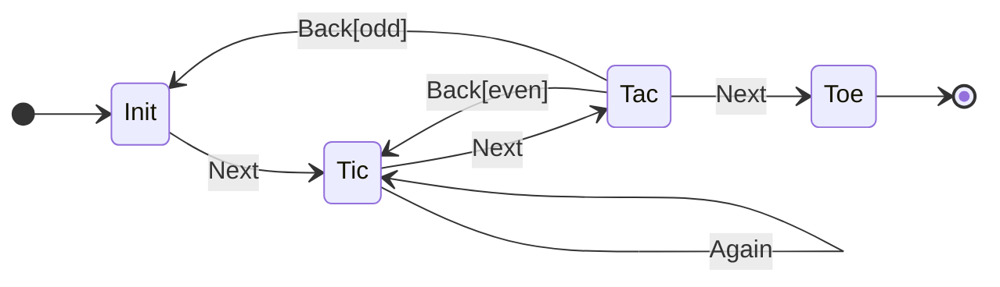

# enhanced-state-machine

Enhanced version of the simple state machine to include: guards and effects on triggers; and extends state actions to include exit and entry.

## StateMachine (default export)

The default export is a function (`StateMachine`) that is to be called with an object defining the State Model (as defined below). It will return an object containg two methods:

- `triggerEvent` - Facilitates the transition from the current STATE to a new STATE depending on the TRIGGER being fired.
- `revert` - reverts the last recored state transition and restores the payload to the version present at the previous state.
- `hstory` - returns a copy of the recorded history

### triggerEvent method

The `triggerEvent` function is called with one or two arguments. The first parameter is mandatory as specifies the TRIGGER to be used to effect the transition.

The optional second parameter (`payload`) is a dataset that is passed to the ACTION of the target STATE when it is called.

## State Model

The states, triggers and guards that comprise the model are defined in an object as follows:

```JSON
{
  STATE_NAME: { // Current state
    TRIGGER_NAME?: [ // Listed in order of priority
      {
        STATE_NAME, // Potential new state
        GUARD_NAME? // Optional predicate
      },
      :
    ],
    :
  },
  :
}
```

At the top-level of the model is a list of STATES, one for each property at the top of the object. By default the first STATE is assumed to be the initial state but no Entry functionn will be executed. Each STATE is an object containing all the TRIGGERS from the current state.

Each TRIGGER is an object containing at minimum the potential new state. In additional a guard condition cane be included in the form of a predicate function.

Alongside the State Model there will be a list of entry and exit Actions (functions) and Guard (predicate) functions. The actions/guards are grouped by the current state, all of which are passed the current context as the `payload` parameter.

```JS
const actions = {
  STATE: {
    enter: function,
    exit: function,
    guards: { // optional
      PREDICATE: (PAYLOAD) => true|false
    }
  },
  :
};
```

---

### Test State Model



### Test data

```json
{
  "init": {
    "next": [{ "state": "tic" }]
  },
  "tic": {
    "next": [{ "state": "tac" }],
    "again": [{ "state": "tic" }]
  },
  "tac": {
    "next": [{ "state": "toe" }],
    "back": [
      { "state": "tic", "guard": "tac_back_even" },
      { "state": "init", "guard": "tac_back_odd" }
    ]
  },
  "toe": {}
}
```

---
